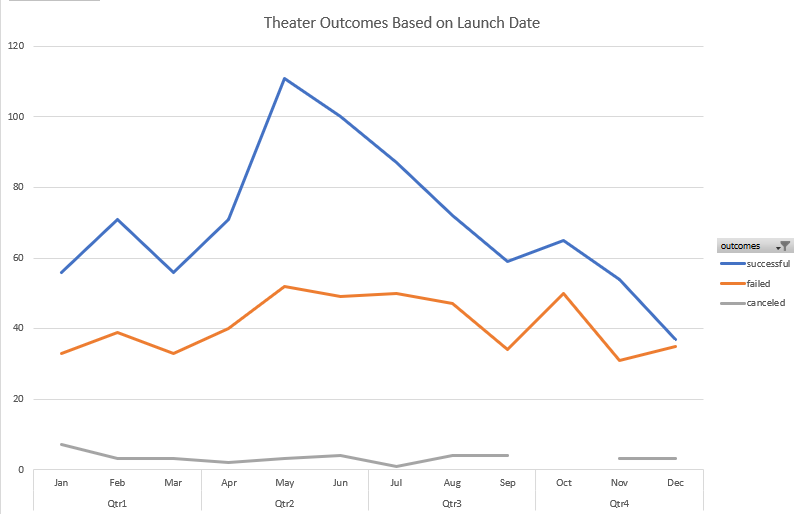
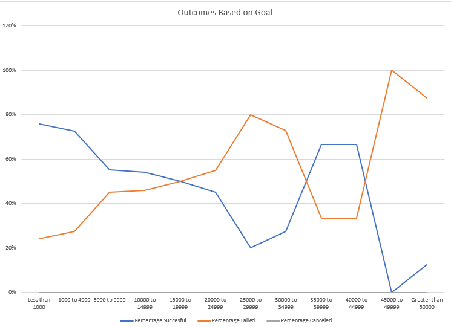

# Kickstarting with Excel

## Overview of Project
data analysis on several thousand crowdfunding projects to uncover any hidden trends
### Purpose
The purpose is to make use of basic and important functions of excel to perform an analysis of the kickstarters project to see if the campaigns were successful and more
## Analysis and Challenges

### Analysis of Outcomes Based on Launch Date

### Analysis of Outcomes Based on Goals

### Challenges and Difficulties Encountered
Several problems that were found in this challenge have to do with the fact that several columns such as dates are not written in their format that they should be and had to be changed from general to date. Also with the use of the countifs function, since when using several criteria it was easier to make mistakes, so you had to be more careful in long functions
## Results

- What are two conclusions you can draw about the Outcomes based on Launch Date?
The theater's results by release date were more successful in the months of May, June and July, while the total of successful launches was 839 successful against 493 failures
- What can you conclude about the Outcomes based on Goals?
the smaller the goal, the more successful the subcategory plays campaign was
- What are some limitations of this dataset?
This dataset does not take the consumer into account, it only takes money into account
- What are some other possible tables and/or graphs that we could create?
A table that could have been interesting is which country had the most successful campaigns depending on any category with a pivot table
